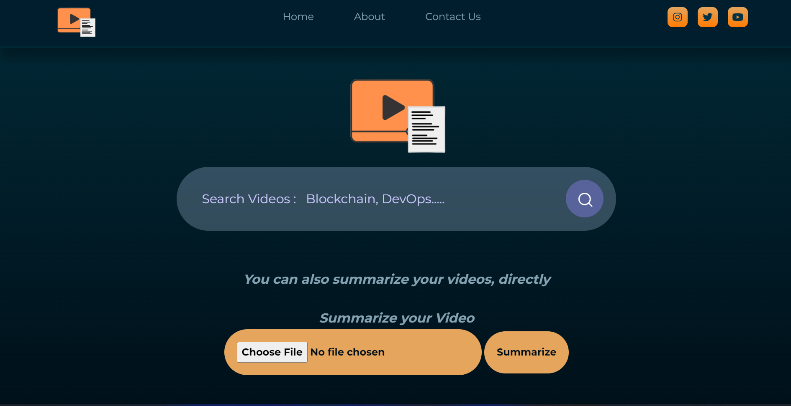

# SummitUp

### A multilingual video summarizer and video search engine

SummitUp uses machine learning based approach to summarize the content and give the glimpse of the video lecture. Additionally we have integrated video search engine in which user could search any video by giving description of his/her needs.

### Brief Description 
For video summarizer,we have trained Simple Transformer T5 model on new summary dataset published by Kondalarao Vonteru on Kaggle.We have performed various data preprocessing tasks over it and have trained over 2 epochs with the training batchsize of 8 and evaluate_during_training_steps as 10000. After that we have also used distilbart-cnn-12-6 model along with BartTokeniser for further accuracy in generating extractive summary out of the context. For this task user will  upload video on our webapp search engine for generating summarized content.Our backend would be generating the transcript out of the video and would be preprocessing it before feeding it into the trained model.Once the required data is fed into the model then it would generate extractive summary out of it which could be used for various purposes including:  

- Analyse the video content 
- Qualitative content based analysis over lectures 
- A quick revision tool

For text based video search engine we are using same summarising model that we used for video summarisation to get the higher level context of description provided y the user for video search. For this we have already generated transcripts of few videos in our dataset and we would be matching similarity index between query and transcript to suggest the most relevant videos to the users. 

### TechStack and technologies used
- Natural Language Processing
- Deep Learning
- Django
- Javascript
- HTML and CSS

### Youtube Video         [Link](https://youtu.be/x3j_eX_2Jb8)
### Deployed Project Link [Link](https://summit-up.herokuapp.com/)